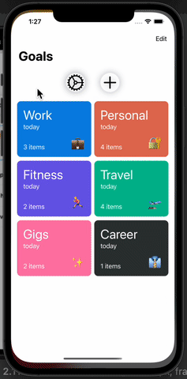

# GoalsAppSwiftUI
A goals app hooked with Firebase

## Summary
An app where users input goal categories with sets of inidividual goals in each of the categories, a longside with dates and color coding. All data is stored in Firebase Firestore.

## Built With
* [SwiftUI](https://developer.apple.com/tutorials/swiftui)
* [UIKit](https://developer.apple.com/documentation/uikit)
* [Firebase](https://firebase.google.com/)

## Gif of App


## Installation Steps For Local Running
1. Clone project.
2. Open terminal
3. cd 'your-desired-path'
4. git clone 'paste-link-here'
5. open project in Xcode and run

## Code Snippet Of Adding Goal To Firebase
```swift
    private let db = Firestore.firestore()
    
    func add(goal: Goal, completion: @escaping (Result<Goal?, Error>) -> Void) {
        do {
            
            let ref = try db.collection("goals").addDocument(from: goal)
            
            ref.getDocument { snapshot, error in
                guard let snapshot = snapshot, error == nil else {
                    completion(.failure(error ?? NSError(domain: "snapshot is nil", code: 101, userInfo: nil)))
                    return
                }
                
                let goal = try? snapshot.data(as: Goal.self)
                completion(.success(goal))
            }
            
        } catch let error {
            completion(.failure(error))
        }
```

## Author

* **Mehdi Safari**

- [Link to Github](https://github.com/mehdisafari77)
- [Link to LinkedIn](https://www.linkedin.com/in/mehdi-safari-992799142/)

